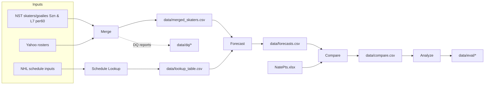

# NSTstats – High‑Level Process Overview

This document summarizes the main end‑to‑end processes in this project and how the CLI ties them together.

## 1) Data Ingestion and Ownership Merge

Purpose: Gather actual performance from Natural Stat Trick (NST) and join to Yahoo Fantasy rosters to attribute players to a fantasy team (`team_name`).

Inputs and sources:
- NST skater/goalie stats (season‑to‑date and last 7 games). Rates are per‑60 (NST `rate=y`).
- Yahoo Fantasy roster export (current league rosters/ownership).
- Local normalization helpers for names/teams/positions (helpers/normalization.py).

Process (via CLI):
- `nst`: fetch/refresh NST skater and goalie datasets in canonical CSV/Parquet form.
- `yahoo`: fetch or refresh Yahoo roster data.
- `merge`: merge NST stats with Yahoo ownership using local normalization helpers, producing per‑player rows with `team_name` attribution.
- `all`: convenience orchestration that runs `yahoo` and `nst` (and you can run `merge` after as needed).

Key outputs:
- `data/merged_skaters.csv` (and analogous outputs for goalies, if applicable).
- Data quality artifacts (see next section) such as unmatched players and merge reports.

Notes on metrics:
- Actuals tracked for both season‑to‑date (Szn) and last‑7 games (L7).
- Metrics are per‑60 rates consistent with NST (`rate=y`).

## 2) Data Quality (DQ)

Purpose: Ensure merges and distributions look correct; surface issues early.

Artifacts (examples from this repo):
- `data/unmatched_in_merged.csv`: players present in inputs but not merged (naming/ID issues).
- `data/dq_merge_report.json`: summary of merge events, counts, or anomalies.
- Distribution diagnostics produced by the `dq` CLI subcommand under `data/dq/<timestamp>/...`.

How to run diagnostics:
- `python -m app.cli dq --windows szn l7 --metrics G A PPP SOG FOW HIT BLK PIM --min-n 25 --out data/dq`
  - Produces per‑window/per‑metric plots and CSVs for quick visual checks.

DQ checks we perform (and suggested additions):
- Merge coverage and identity
  - Percent of NST players matched to Yahoo ownership; track over time.
  - Count by mismatch category (name variant, diacritics, duplicate names/IDs).
  - Export `unmatched_in_merged.csv` with helpful columns: input name, guessed canonical, suggested fixes.
- Distribution sanity by metric and window
  - For each metric (G, A, PPP, SOG, FOW, HIT, BLK, PIM) and window (Szn, L7), check:
    - Outliers (e.g., > 5 SD from mean in per‑60).
    - Heavy‑tail behavior and long‑term shifts week‑over‑week.
    - Position‑conditioned distributions (F/D/G where applicable).
- Ownership attribution
  - Verify that every owned player maps to exactly one `team_name` and that free agents are flagged consistently.
  - Flag cases where a player appears on multiple Yahoo rosters (stale export) or none (recent drop/add).
- Schema and ranges
  - Required columns present with expected dtypes; per‑60 rates non‑negative and within plausible bounds by metric.

Common mismatch patterns and remediation:
- Name variants (e.g., "Alex Ovechkin" vs "Alexander Ovechkin").
  - Remediation: Improve local normalization rules (helpers/normalization.py); keep a curated alias map if needed.
- Suffixes and initials ("Jr.", middle initials).
  - Remediation: Strip or standardize in a preprocessing normalizer before joins.
- Recent call‑ups or new players appearing after the last refresh.
  - Remediation: Re-run Yahoo and NST ingestion; normalization rules will cover most cases.
- Duplicates due to multiple data rows (team changes, position changes).
  - Remediation: Use stable player IDs as primary keys; deduplicate with latest team context.

Suggested DQ workflow:
1. After `merge`, inspect `data/unmatched_in_merged.csv` and `data/dq_merge_report.json`.
2. Run `dq` distributions for Szn and L7 on key metrics; review plots in `data/dq/<timestamp>/`.
3. Apply registry updates or alias fixes, re‑run `merge`, and re‑run `dq` to confirm improvements.
4. Keep a changelog of registry aliases and a dashboard of coverage metrics.

Automation ideas:
- Add a pre‑forecast gate: block `forecast` if coverage falls below a threshold or if severe anomalies are detected.
- Persist historical DQ metrics to trend coverage and distribution stability.

## 3) Schedule Lookup (Horizon Support)

Purpose: Build a team/date lookup table to count upcoming games across horizons (e.g., Rest‑Of‑Week, Next Week, Rest‑Of‑Season) and support strength‑of‑schedule adjustments.

How to build/update:
- `python -m app.cli --schedule-lookup` (top‑level flag) or
- `python -m app.cli schedule-lookup`

Default output:
- `data/lookup_table.csv` – a consolidated lookup table built via `nhl_schedule.build_lookup`.

## 4) Forecasting

Purpose: Produce per‑player stat forecasts across requested horizons using a blend of Szn and L7 per‑60 rates and schedule context.

CLI:
- `python -m app.cli forecast --current-week <N> [--season-weight 0.8 --last7-weight 0.2 --sos-weight 0.3 --horizons row next ros --skaters-csv data/merged_skaters.csv --lookup-csv data/lookup_table.csv --out-csv data/forecasts.csv]`

Method (high level):
- Blend rates: `blend = season_weight * Szn_per60 + last7_weight * L7_per60`.
- Scale by expected opportunities from the schedule (games in each horizon).
- Apply schedule strength adjustment (`sos_weight`) if configured.

Output:
- `data/forecasts.csv` – horizon‑specific forecast columns for key fantasy metrics (G, A, PPP, SOG, FOW, HIT, BLK, PIM, ...).

## 5) Compare (Benchmarks & Projections)

Purpose: Compare our forecasts to external projections (e.g., `NatePts.xlsx`) and optional last‑year rate benchmarks.

CLI:
- `python -m app.cli compare --current-week <N> --forecast-csv data/forecasts.csv --lookup-csv data/lookup_table.csv --proj-xlsx NatePts.xlsx --proj-sheet NatePts --horizons row next ros --out-csv data/compare.csv [--all-players] [--ly-sit-s <csv>] [--ly-sit-pp <csv>]`

Inputs:
- `NatePts.xlsx` (sheet/table `NatePts` by default).
- Optional last‑year NST per‑60 datasets (all‑situations and power‑play) for context.

Output:
- `data/compare.csv` – a consolidated table for further analysis or reporting.

## 6) Analyze (Season‑Total Evaluation)

Purpose: Evaluate season‑to‑date accuracy against projections and export summary metrics and Excel reports.

CLI:
- `python -m app.cli analyze --compare-csv data/compare.csv --out-dir data/eval`

Outputs:
- `data/eval/metrics_by_position.csv`, `data/eval/season_total_eval.xlsx`, and plots under `data/eval/_plots`.

## Command Summary (Quick Start)

- End‑to‑end refresh (inputs):
  - `python -m app.cli all`
  - then `python -m app.cli merge`
- Schedule lookup:
  - `python -m app.cli --schedule-lookup`
- Forecasts:
  - `python -m app.cli forecast --current-week 12`
- Compare:
  - `python -m app.cli compare --current-week 12`
- Analyze:
  - `python -m app.cli analyze`
- Diagnostics (distributions):
  - `python -m app.cli dq --windows szn l7 --metrics G A PPP SOG FOW HIT BLK PIM`

## Key Files and Directories

- Inputs/Config
  - `NatePts.xlsx` – external projections
  - `Team2TM.xlsx` – team mapping (if applicable)
  - `config.py`, `secrets.json` – configuration and secrets
- Intermediate/Outputs
  - `data/merged_skaters.csv` – merged NST+Yahoo per‑player
  - `data/lookup_table.csv` – schedule lookup
  - `data/forecasts.csv` – forecast results
  - `data/compare.csv` – comparison dataset
  - `data/eval/*` – evaluation metrics, Excel, and plots
  - `data/dq/*` – diagnostics outputs
  - `data/unmatched_in_merged.csv`, `data/dq_merge_report.json` – data quality/merge reports

## Suggested Workflow (Conceptual)

1. Refresh inputs (NST and Yahoo)
2. Merge to attribute ownership (`team_name`)
3. Build schedule lookup
4. Forecast across horizons (ROW, Next Week, ROS; later EoS)
5. Compare to external projections / last‑year baselines
6. Analyze season‑total accuracy; iterate

If helpful, you can capture this visually with a Mermaid diagram in Markdown (PyCharm supports Mermaid diagrams):

## PyCharm Tips for Documenting/Presenting the Workflow

- Markdown + Mermaid
  - PyCharm (2023.2+) can render Mermaid diagrams in Markdown. This file’s flowchart should render in the IDE preview. You can keep high‑level docs alongside code.
- Diagrams (Project Structure)
  - View > Tool Windows > Structure; also try Diagrams for Python packages: Right‑click a package > Diagrams > Show Diagram.
- Run/Debug Configurations
  - Create dedicated configurations for each CLI subcommand (e.g., `schedule-lookup`, `forecast`, `compare`, `analyze`). Group them or create a Compound configuration to run several steps sequentially.
- Scratch Files
  - Use Scratch Markdown files for quick notes/diagrams during iteration without committing to the repo until ready.
- TODOs and Bookmarks
  - Leave `TODO:` comments near pipeline stages and use the TODO tool window for a quick backlog that maps to this workflow.
