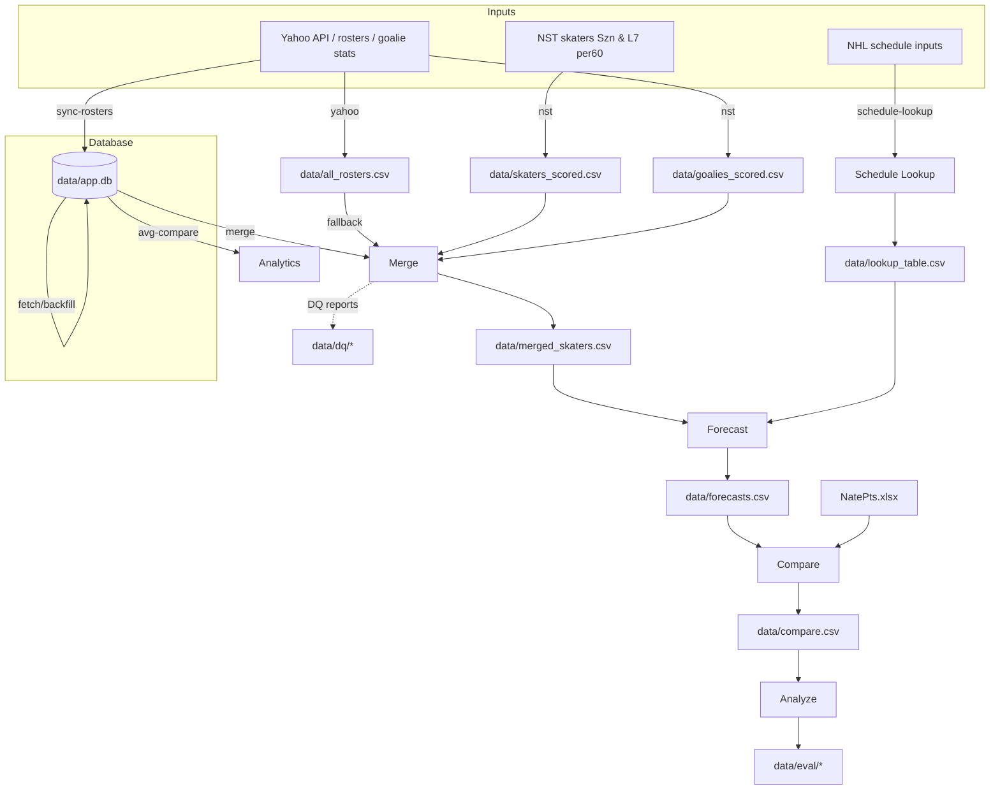

# NSTstats – High‑Level Process Overview

This document summarizes the main end‑to‑end processes in this project and how the CLI ties them together.

## 1) Data Ingestion and Ownership Merge

Purpose: Gather actual performance from Natural Stat Trick (NST) for skaters and Yahoo Fantasy for goalies, and join to Yahoo Fantasy rosters to attribute players to a fantasy team (`team_name`).

Inputs and sources:
- NST skater stats (season‑to‑date and last 7 games). Rates are per‑60 (NST `rate=y`).
- Yahoo Fantasy goalie stats (season-to-date and last week).
- Yahoo Fantasy roster export (current league rosters/ownership).
- Local normalization helpers for names/teams/positions (helpers/normalization.py).

Process (via CLI):
- `init-weeks`: population of the local database `Week` table with start and end dates for a given league and season. This is required for all subsequent database-backed commands.
  - `python -m app.cli init-weeks --league-key nhl.p.2526 --season 2025`
- `sync-rosters`: synchronizes the current Yahoo league rosters to the local database `CurrentRoster` table. This also populates league settings, stat categories, and roster requirements in the database.
  - `python -m app.cli sync-rosters --league-key nhl.p.2526`
  - **Caching**: This command now caches results for the day. If it has already run today, it will skip fetching unless the `--force` flag is used.
- `nst`: fetch/refresh skater stats from NST and goalie stats from the Yahoo Fantasy API; compute scored outputs for both.
  - Produces `data/skaters_scored.csv` and `data/goalies_scored.csv` (and league-specific versions).
  - Goalie fetching now uses the Yahoo API exclusively.
  - **Caching**: This command now caches results for the day. If it has already run today, it will skip fetching unless the `--force` flag is used.
  - **Minimizing API Calls**: If rosters were already synced today (via `sync-rosters`), the Yahoo component of `nst` will skip redundant roster fetches.
  - Prior-season caching: if both `data/skaters_scored_prior.csv` and `data/goalies_scored_prior.csv` already exist, the prior-season fetch/scoring is skipped by default since last-year stats do not change during the current season.
    - Use `python -m app.cli nst --refresh-prior` to force a re-fetch/re-score of the prior season.
    - Use `python -m app.cli nst --skip-prior` to explicitly skip the prior-season step regardless of cache state.
- `yahoo`: fetch or refresh Yahoo roster data (produces `data/all_rosters.csv`).
- `merge`: merge NST stats with Yahoo ownership using local normalization helpers, producing per‑player rows with `team_name` attribution.
  - **Note**: The merge process now relies exclusively on the local database for roster information. `data/all_rosters.csv` is no longer used as a fallback.
- `all`: convenience orchestration that runs `yahoo`, `nst`, and `merge`.

### Composite Workflows
- `daily`: runs `sync-rosters`, `all`, and `schedule-lookup`. If multiple leagues are present in the database, it processes all of them. Prompts for `current-week`. Supports `--force` to override all daily caching (rosters, NST, and schedule).
- `weekly`: runs `fetch-daily-gp`, `backfill-gp`, and `avg-compare` for the prior week. If multiple leagues are present, it loops through them, attempting to auto-detect teams like "Bad Tape Hockey". Prompts for `current-week`, and optionally `team-id`/`opp-team-id`.

### Multi-League and Points Support
- The system supports managing multiple Yahoo leagues simultaneously by persisting their configuration in the local database (`data/app.db`).
- Points-based leagues are handled by ingesting stat values (weights) from Yahoo settings during `sync-rosters` and calculating "FantasyPoints" columns during the scoring step.
- Outputs for separate leagues are saved with a league ID suffix, e.g., `data/skaters_scored_105618.csv` and `data/merged_skaters_105618.csv`.
- Scoring and merging logic iterates through all leagues found in the database.

Key outputs:
- `data/merged_skaters.csv` (and analogous outputs for goalies, if applicable).
- Data quality artifacts (see next section) such as unmatched players and merge reports.
- Local SQLite database `data/app.db` containing synced rosters, weeks, and historical GP data.

Notes on metrics and scoring (see also [SCORING.md](./SCORING.md)):
- Actuals tracked for both season‑to‑date (Szn) and last‑7 games (L7). 
- **Goalies**: Sourced from Yahoo API. The **L7 window uses Yahoo's "Last Week" stats**.
- Skaters are scored into percentile‑based T_scores per metric and window, with Offensive/Banger/Composite indexes.
- Goalies are scored analogously on GA, SV%, GAA, W, SV, SHO per window, with a Goalie_Index per window.
- Skater inputs use NST per‑60 rates (`rate=y`).

## 2) Data Quality (DQ)

Purpose: Ensure merges and distributions look correct; surface issues early. See docs/DATA_QUALITY.md for detailed guidance and outputs, including prior-season diagnostics.

Artifacts (examples from this repo):
- `data/unmatched_in_merged.csv`: players present in inputs but not merged (naming/ID issues).
- `data/dq_merge_report.json`: summary of merge events, counts, or anomalies.
- Distribution diagnostics produced by the `dq` CLI subcommand:
  - Current season under `data/dq/<timestamp>/...` (skaters and goalies; results combined in summary files).
  - Prior season (if prior inputs exist) under `data/dq/prior/<same_timestamp>/...` as a separate sibling directory.

How to run diagnostics:
- `python -m app.cli dq --windows szn l7 --metrics G A PPP SOG FOW HIT BLK PIM --min-n 25 --out data/dq`
  - Produces per‑window/per‑metric plots and CSVs for current season in `data/dq/<timestamp>/`.
  - Goalie diagnostics (GA, SV%, GAA) read from `data/merged_goalies.csv` and prior from `data/merged_goalies_prior.csv`.
  - If the following prior-season files exist, they are automatically processed and written to `data/dq/prior/<same_timestamp>/` (default window szn only):
    - Skaters prior: `data/merged_skaters_prior.csv`
    - Goalies prior: `data/merged_goalies_prior.csv`
  - You can override the skater prior input path with `--prior-csv <path>`.

DQ checks we perform (and suggested additions):
- Merge coverage and identity
  - Percent of NST players matched to Yahoo ownership; track over time.
  - Count by mismatch category (name variant, diacritics, duplicate names/IDs).
  - Export `unmatched_in_merged.csv` with helpful columns: input name, guessed canonical, suggested fixes.
- Distribution sanity by metric and window
  - For each metric (G, A, PPP, SOG, FOW, HIT, BLK, PIM) and window (Szn, L7), check:
    - Outliers (e.g., > 5 SD from mean in per‑60).
    - Heavy‑tail behavior and long‑term shifts week‑over‑week.
    - Position‑conditioned distributions (F/D for skaters; G for goalies). Skater segmentation uses the `pos_group` column if present; otherwise it is derived from position with robust recognition of defense encodings (D, LD, RD, F/D, D/F, ...).
- Ownership attribution
  - Verify that every owned player maps to exactly one `team_name` and that free agents are flagged consistently.
  - Flag cases where a player appears on multiple Yahoo rosters (stale export) or none (recent drop/add).
- Schema and ranges
  - Required columns present with expected dtypes; per‑60 rates non‑negative and within plausible bounds by metric.

Common mismatch patterns and remediation:
- Name variants (e.g., "Alex Ovechkin" vs "Alexander Ovechkin").
  - Remediation: Improve local normalization rules (helpers/normalization.py); keep a curated alias map if needed.
- Suffixes and initials ("Jr.", middle initials).
  - Remediation: Strip or standardize in a preprocessing normalizer before joins.
- Recent call‑ups or new players appearing after the last refresh.
  - Remediation: Re-run Yahoo and NST ingestion; normalization rules will cover most cases.
- Duplicates due to multiple data rows (team changes, position changes).
  - Remediation: Use stable player IDs as primary keys; deduplicate with latest team context.

Suggested DQ workflow:
1. After `merge`, inspect `data/unmatched_in_merged.csv` and `data/dq_merge_report.json`.
2. Run `dq` distributions for Szn and L7 on key metrics; review plots in `data/dq/<timestamp>/` for current season and `data/dq/prior/<same_timestamp>/` for prior season when available.
3. Apply registry updates or alias fixes, re‑run `merge`, and re‑run `dq` to confirm improvements.
4. Keep a changelog of registry aliases and a dashboard of coverage metrics.

Automation ideas:
- Add a pre‑forecast gate: block `forecast` if coverage falls below a threshold or if severe anomalies are detected.
- Persist historical DQ metrics to trend coverage and distribution stability.

## 3) Schedule Lookup (Horizon Support)

Purpose: Build a team/date lookup table to count upcoming games across horizons (e.g., Rest‑Of‑Week, Next Week, Rest‑Of‑Season) and support strength‑of‑schedule adjustments.

How to build/update:
- `python -m app.cli --schedule-lookup` (top‑level flag) or
- `python -m app.cli schedule-lookup`
- **Caching**: This command now caches results for the day. If it has already run today, it will skip execution unless the `--force` flag is used.

Default output:
- `data/lookup_table.csv` – a consolidated lookup table built via `nhl_schedule.build_lookup`.

## 4) Forecasting

Purpose: Produce per‑player stat forecasts across requested horizons using a blend of Szn and L7 per‑60 rates, optional Last‑Year context, and schedule. For how scoring outputs feed forecasting, see [SCORING.md](./SCORING.md).

See also: docs/FORECAST.md

CLI:
- `python -m app.cli forecast --current-week <N> [--season-weight 0.8 --last7-weight 0.2 --last-year-weight 0.0 --sos-weight 0.3 --horizons row next ros --skaters-csv data/merged_skaters.csv --lookup-csv data/lookup_table.csv --out-csv data/forecasts.csv]`

Method (high level):
- Blend rates: `blend = season_weight * Szn_per60 + last7_weight * L7_per60 + last_year_weight * LY_per60` (weights are normalized over available values).
- Convert to per‑game using TOI/GP (PP for PPP; all‑situations otherwise) and scale by schedule games for each horizon.
- Apply schedule strength adjustment (`sos_weight`) if configured.

Output:
- `data/forecasts.csv` – horizon‑specific forecast columns for key fantasy metrics (G, A, PPP, SOG, FOW, HIT, BLK, PIM, ...).

## 5) Compare (Benchmarks & Projections)

Purpose: Compare our forecasts to external projections (e.g., `NatePts.xlsx`) and optional last‑year rate benchmarks.

See also: docs/COMPARE.md

CLI:
- `python -m app.cli compare --current-week <N> --forecast-csv data/forecasts.csv --lookup-csv data/lookup_table.csv --proj-xlsx NatePts.xlsx --proj-sheet NatePts --horizons row next ros --out-csv data/compare.csv [--all-players] [--ly-sit-s <csv>] [--ly-sit-pp <csv>]`

Inputs:
- `NatePts.xlsx` (sheet/table `NatePts` by default).
- Optional last‑year NST per‑60 datasets (all‑situations and power‑play) for context.

Output:
- `data/compare.csv` – a consolidated table for further analysis or reporting.

## 6) Analyze (Season‑Total Evaluation)

Purpose: Evaluate season‑to‑date accuracy against projections and export summary metrics and Excel reports.

See also: docs/ANALYZE.md

CLI:
- `python -m app.cli analyze --compare-csv data/compare.csv --out-dir data/eval`

Outputs:
- `data/eval/metrics_by_position.csv`, `data/eval/season_total_eval.xlsx`, and plots under `data/eval/_plots`.

## 7) League Analytics & Backfilling (Database-backed)

Purpose: Perform advanced analytics such as team vs. opponent comparisons and backfill historical games played (GP) data from Yahoo to the local database.

See also: [docs/AVG_COMPARE_AND_BACKFILL_GP.md](./AVG_COMPARE_AND_BACKFILL_GP.md)

### avg-compare
- `python -m app.cli avg-compare --league-key nhl.p.2526 --current-week 9 --team-id 4 --opp-team-id 8`
- Computes average stat comparisons for a given team vs. a specific opponent and vs. the league average.

### fetch-daily-gp
- `python -m app.cli fetch-daily-gp --league-key nhl.p.2526 --start-week 1 --end-week 8`
- Populates `RosterSlotDaily` by fetching team rosters and per‑date player stats from Yahoo.

### backfill-gp
- `python -m app.cli backfill-gp --league-key nhl.p.2526 --start-week 1 --end-week 8`
- Aggregates daily roster slots into weekly totals per player (`WeeklyPlayerGP`).

### waiver-agent
- `python -m app.cli waiver-agent --team-name "Your Team Name" --current-week 12`
- Recommends waiver-wire streamers versus your current roster based on forecasts and position needs.

## Command Summary (Quick Start)

- Initialize Database:
  - `python -m app.cli init-weeks --league-key nhl.p.2526`
  - `python -m app.cli sync-rosters --league-key nhl.p.2526`
- Composite Workflows (Recommended):
  - `python -m app.cli daily` (Run Monday-Sunday)
  - `python -m app.cli weekly` (Run Mondays to finalize prior week)
- End‑to‑end refresh (inputs):
  - `python -m app.cli all`
  - then `python -m app.cli merge`
- Schedule lookup:
  - `python -m app.cli --schedule-lookup`
- Forecasts:
  - `python -m app.cli forecast --current-week 12`
- Compare:
  - `python -m app.cli compare --current-week 12`
- Analyze:
  - `python -m app.cli analyze`
- Diagnostics (distributions):
  - `python -m app.cli dq --windows szn l7 --metrics G A PPP SOG FOW HIT BLK PIM`
- Waiver Recommendations:
  - `python -m app.cli waiver-agent --team-name "Trocheck Backcheck Paycheque" --current-week 12`

## Key Files and Directories

- Inputs/Config
  - `NatePts.xlsx` – external projections
  - `Team2TM.xlsx` – team mapping (if applicable)
  - `config.py`, `secrets.json` – configuration and secrets
- Intermediate/Outputs
  - `data/merged_skaters.csv` – merged NST+Yahoo per‑player
  - `data/lookup_table.csv` – schedule lookup
  - `data/forecasts.csv` – forecast results
  - `data/compare.csv` – comparison dataset
  - `data/eval/*` – evaluation metrics, Excel, and plots
  - `data/dq/*` – diagnostics outputs
  - `data/unmatched_in_merged.csv`, `data/dq_merge_report.json` – data quality/merge reports

## Suggested Workflow (Conceptual)

1. Refresh inputs (NST and Yahoo)
2. Merge to attribute ownership (`team_name`)
3. Build schedule lookup
4. Forecast across horizons (ROW, Next Week, ROS; later EoS)
5. Compare to external projections / last‑year baselines
6. Analyze season‑total accuracy; iterate

If helpful, you can capture this visually with a Mermaid diagram in Markdown (PyCharm supports Mermaid diagrams):

## PyCharm Tips for Documenting/Presenting the Workflow

- Markdown + Mermaid
  - PyCharm (2023.2+) can render Mermaid diagrams in Markdown. This file’s flowchart should render in the IDE preview. You can keep high‑level docs alongside code.
- Diagrams (Project Structure)
  - View > Tool Windows > Structure; also try Diagrams for Python packages: Right‑click a package > Diagrams > Show Diagram.
- Run/Debug Configurations
  - Create dedicated configurations for each CLI subcommand (e.g., `schedule-lookup`, `forecast`, `compare`, `analyze`). Group them or create a Compound configuration to run several steps sequentially.
- Scratch Files
  - Use Scratch Markdown files for quick notes/diagrams during iteration without committing to the repo until ready.
- TODOs and Bookmarks
  - Leave `TODO:` comments near pipeline stages and use the TODO tool window for a quick backlog that maps to this workflow.
